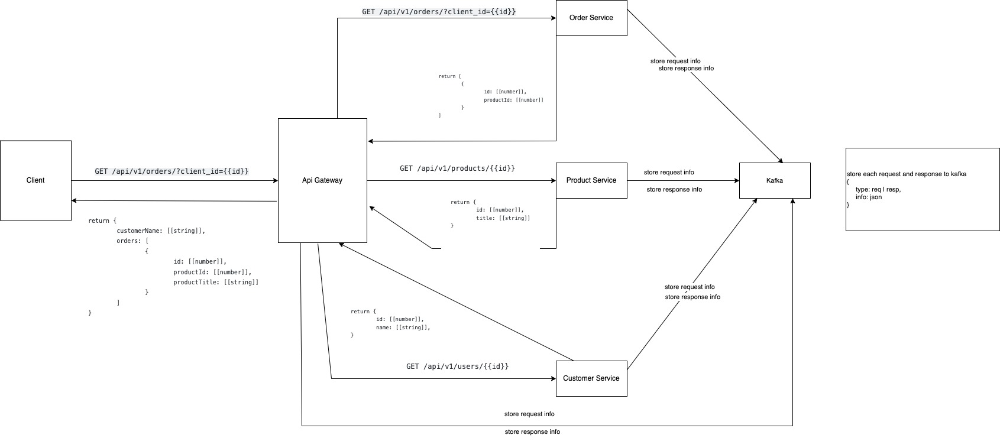

### Architecture



### Run

```make up```

### Stop

```make down```

### TODO

- [ ] setup all services on docker-compose.yml
- [x] setup adapter on api-gateway-service (parse response)
- [x] fix find by id on order, customer, product services
- [ ] store to kafka request and response info
- [ ] split by application layers
- [ ] write test
- [x] return ResponseEntity on controllers methods
- [ ] move common code to common module
- [ ] handle exceptions
- [ ] Service registry as library on common module
