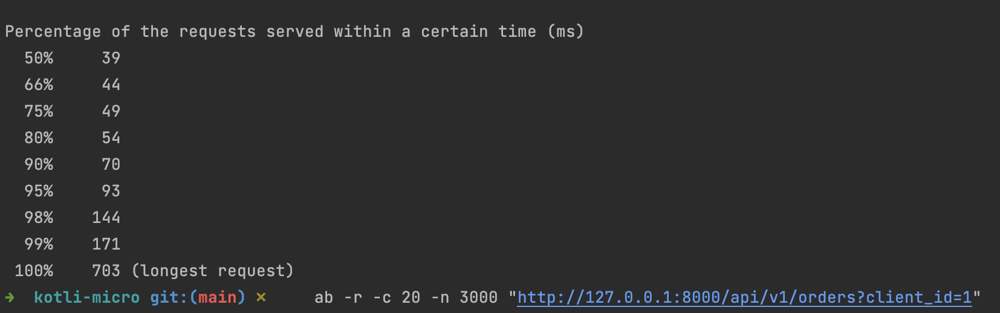
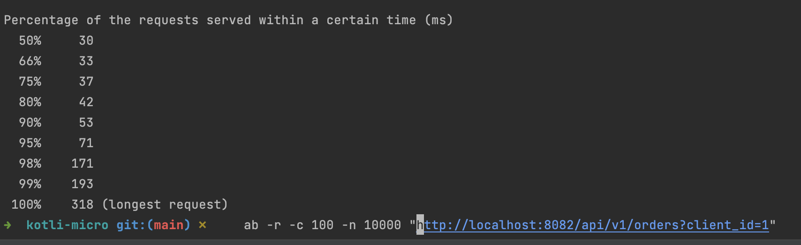
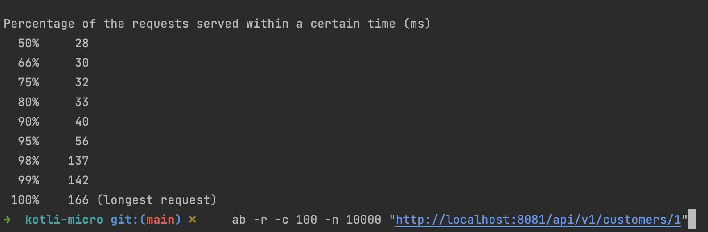
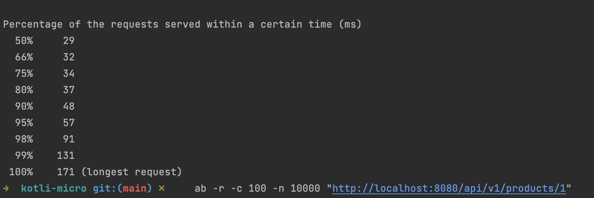

### Architecture


## Benchmark

### Benchmark api-gateway service



### Benchmark order service



### Benchmark customer service



### Benchmark product service



### Run

```make up```

### Stop

```make down```

### TODO

- [x] store to kafka request and response info
- [x] make benchmark
- [ ] write test
- [ ] setup all services on docker-compose.yml
- [ ] split application to layers
- [ ] move common code to common module
- [ ] service registry as library on common module for event validation
